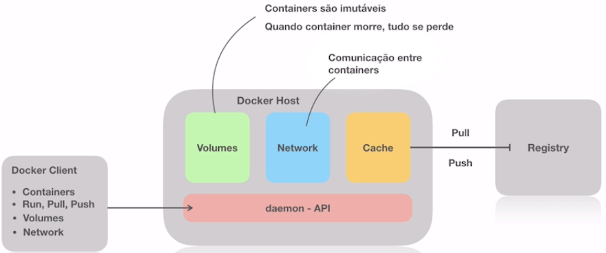

# Docker

#### Curso Full Cycle - Módulo Docker

#### Objetivos
- O que são Containers
- Como funcionam os Containers
- Como o Docker funciona
- Principais comandos utilizando Docker
- Dockerfile
- Trabalhando com imagens Docker

##### O que são containers?
Um container é um padrão de unidade de software que empacota código e todas as dependências de uma aplicação fazendo que a mesma seja executada repidamente de forma confiavel de um ambiente computacional.

<b>Namespaces:</b> Sistemas operacionais trabalhando com base em processos, processos utilizam de Namespaces com o objetivo de isolar esse conjunto de processos (Processo pai e seus processos filhos);

Container é um processo isolado com subprocessos emulando um sistema operacional

<b>Cgroups</b>: É uma descoberta do Google que facilitou a utilização de container, resumindo: Containers não existem sem o Cgroups. 
Cgroups tem como objetivo controlar os recursos computacionais do container: Memória, CPU

<b>File System - OFS (Overlay File System)</b>: Feito para evitar a duplicidade de dependências. O Container reaproveita todo o Kernel do SO evitando ter um SO para cada container.

##### Imagens
Images Docker são compostas por sistemas de arquivos de camadas que ficam uma sobre as outras. Ela é a nossa base para construção de uma aplicação, ela pode ser desde o base do CentOS como também um CentOS com Apache, PHP e MySQL. <b>Cada arquivo torna-se reutilizavel na construção de outras imagens.</b> Cada pedaço de dessa imagem é independente. Imagem é um conjunto de dependencias encadeadas.

##### Dockerfile
Arquivo declarativos para a **construir** imagens. A criação de uma nova imagem sempre deve partir de uma imagem já existente.

``` dockerfile
FROM: ImageName
RUN: Comando ex: apt-get install
EXPOSE: 8000
```

Dockerfile --> **build** --> Image
Container --> **commit** --> Image
Dockerfile <-- **pull** <-- Image Registry
Image --> **push** --> Image Registry



#### Instalando o Docker
Docker foi feito para rodar no linux, por isso, se deseja ter alta performance use linux.
Para Windows existe o WSL que é um subsistema linux no windows.

#### Instalando WSL2
https://github.com/codeedu/wsl2-docker-quickstart

#### Comandos Docker
```bash
docker ps #Lista containers
docker run hello-world #Rodando uma imagem docker
docker run -it ubuntu bash #Modo iterativo
```

#### Publicando portas com nginx
Webserver/Proxy reverso
```bash
docker run nginx #executa o nginx
docker run -p 8080:80 nginx #(-p --detach)executa o nginx deixando a porta 80 do container disponivel na porta 8080
docker run -d -p 8080:80 nginx #(-d --detach)executa o nginx e deixa o terminal disponivel
```
#### Removendo containers
```bash
docker stop b2df619d6acf #Parar um container
docker start b2df619d6acf #Reiniciar um container
docker rm 43156aaf0cd0 #remover containers parados
docker rm b2df619d6acf -f #forçar a remoção de um container que esta em execução
docker rm $(docker ps -a -q) -f #remove todos os container
```

#### Acessando e alterando arquivos de um container
```bash
docker run -d -p 8080:80 --name nginx_01 nginx #Atribuindo um nome ao containers
docker exec nginx_01 ls # Executa o comando "ls" no container
docker exec -it nginx_01 bash # Executa comando no container e permanece no container no modo iterativo

cd /usr/share/nginx/html/
apt-get update
apt-get install vim
vim index.html
```
Container é imutavel, ao parar o container as alterações são perdidas